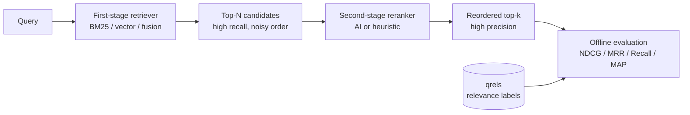
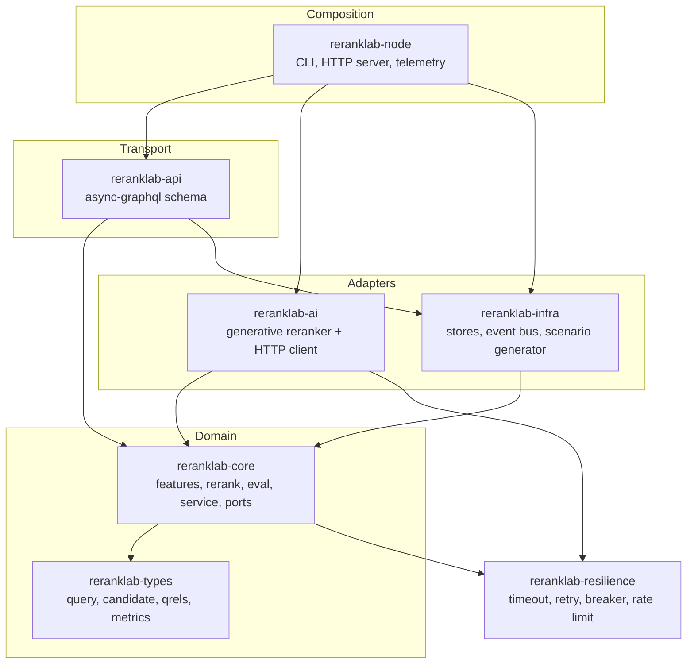
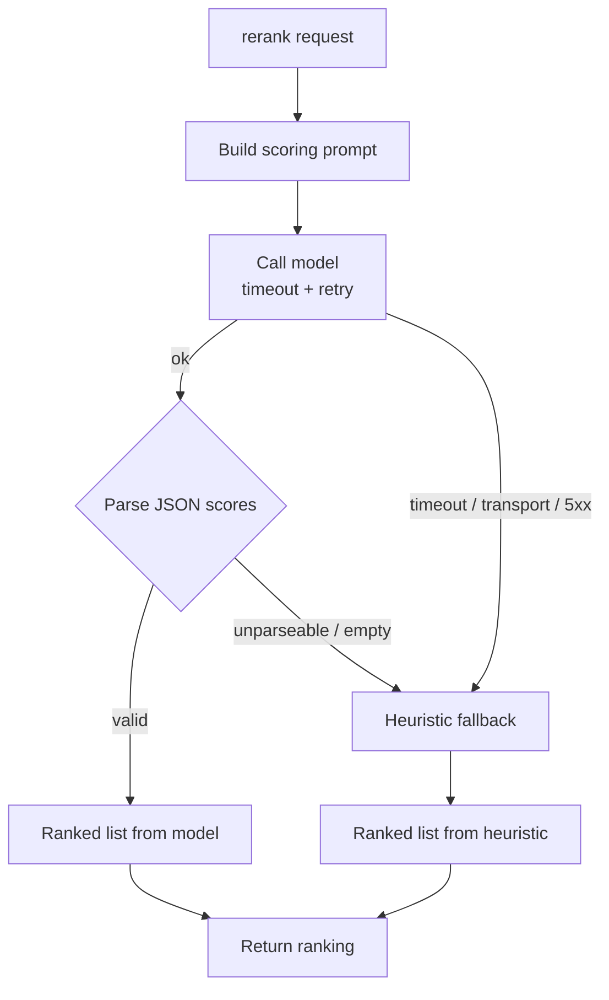

# RerankLab

[](https://github.com/ABHIJEET-MUNESHWAR/RerankLab/actions/workflows/ci.yml)
[](https://www.rust-lang.org)
[](./LICENSE)
[](#test-matrix)

**RerankLab** is a production-grade **second-stage reranking and offline
relevance-evaluation** service written in Rust. It takes the noisy output of a
first-stage retriever and reorders it for relevance — either with a
**generative-AI reranker** or a deterministic **lexical heuristic** — then
**measures** the improvement with the standard IR metrics (NDCG, MRR, Recall,
Precision, MAP) against a labeled `qrels` set.

It is built as a **hexagonal (ports-and-adapters) Cargo workspace** of seven
crates, with a strict inward dependency rule and `#![forbid(unsafe_code)]`
throughout.

---

## Table of Contents

- [Why RerankLab](#why-reranklab)
- [Two-Stage Retrieval](#two-stage-retrieval)
- [Architecture](#architecture)
- [The AI Reranker and its Fallback](#the-ai-reranker-and-its-fallback)
- [Evaluation Metrics](#evaluation-metrics)
- [Crate Layout](#crate-layout)
- [Complexity](#complexity)
- [Quick Start](#quick-start)
- [Demo Output](#demo-output)
- [GraphQL API](#graphql-api)
- [Observability](#observability)
- [Configuration](#configuration)
- [Test Matrix](#test-matrix)
- [Docker](#docker)
- [License](#license)

---

## Why RerankLab

A first-stage retriever (BM25, a vector index, or a fusion of both) is tuned for
**recall and speed**: it must not miss relevant documents, so it casts a wide,
approximate net. The top of that list is often *wrong* — a keyword-heavy but
off-topic page outranks the perfect answer.

**Second-stage reranking** fixes the ordering of a small candidate set with a
more expensive, more accurate model. RerankLab provides:

- **A `Reranker` port** with two implementations: a network-free
  [`HeuristicReranker`] and a generative [`AiReranker`].
- **Graceful degradation** — the AI reranker transparently falls back to the
  heuristic on timeout, error, or a malformed model reply, so the service is
  always correct and fully testable offline.
- **An offline evaluation harness** computing NDCG@k, MRR, Recall@k,
  Precision@k, and MAP against relevance judgments.
- **A typed GraphQL API** for both ad-hoc reranking and end-to-end evaluation,
  plus a live event feed (CQRS read side).

---

## Two-Stage Retrieval



RerankLab owns the **grey** stages: reranking and evaluation. The synthetic
scenario generator stands in for a first-stage retriever, deliberately emitting
a *noisy* candidate order so the reranking lift is measurable.

---

## Architecture

Dependencies point **inward**. The domain core (`types`, `core`) is pure and
framework-free; the AI, infra, API, and node crates depend on it, never the
reverse.



**Ports** (traits in `reranklab-core::ports`) decouple the service from its
collaborators: `Reranker`, `CandidateStore`, `JudgmentStore`, `EventSink`,
`RerankEventStream`. Swapping the heuristic reranker for the AI one — or an
in-memory store for a database — requires no change to the orchestration.

---

## The AI Reranker and its Fallback

The [`AiReranker`] prompts a chat model to score each candidate's relevance,
wraps the call in a **timeout** and **bounded retry with backoff**, parses the
JSON reply — and **falls back** to the heuristic on any failure.



Because the model is expressed as a `ChatModel` **port**, the whole matrix —
success, parse failure, retry exhaustion, non-retryable status — is covered by
deterministic tests with **no network**.

---

## Evaluation Metrics

All metrics are computed at a cutoff `k` against graded relevance judgments.
Let $rel_i$ be the relevance grade of the document at rank $i$ (1-based).

**Discounted Cumulative Gain** and its normalized form:

$$
\mathrm{DCG@k} = \sum_{i=1}^{k} \frac{2^{rel_i} - 1}{\log_2(i + 1)}
\qquad
\mathrm{NDCG@k} = \frac{\mathrm{DCG@k}}{\mathrm{IDCG@k}}
$$

**Reciprocal Rank** (first relevant hit at rank $r$), **Precision**, and
**Recall**:

$$
\mathrm{MRR} = \frac{1}{r}
\qquad
\mathrm{P@k} = \frac{\#\{\text{relevant in top } k\}}{k}
\qquad
\mathrm{R@k} = \frac{\#\{\text{relevant in top } k\}}{\#\{\text{relevant total}\}}
$$

**Average Precision** (mean of precision at each relevant rank), averaged across
queries to give **MAP**:

$$
\mathrm{AP} = \frac{1}{R}\sum_{i=1}^{k} \mathbb{1}[rel_i > 0]\cdot \mathrm{P@}i
$$

---

## Crate Layout

| Crate | Responsibility | Depends on |
|---|---|---|
| `reranklab-types` | `Query`, `Candidate`, `ScoredCandidate`, `RankedList`, `Qrels`, `EvalMetrics` | — |
| `reranklab-resilience` | `Clock`, timeout, retry+backoff, circuit breaker, rate limiter | — |
| `reranklab-core` | features, `HeuristicReranker`, evaluation, `RerankService`, ports, events | types, resilience |
| `reranklab-ai` | `ChatModel` port, `HttpChatModel`, `AiReranker` with fallback | core, types, resilience |
| `reranklab-infra` | in-memory candidate/judgment stores, event bus, scenario generator | core, types |
| `reranklab-api` | `async-graphql` schema (rerank, evaluate, subscription) | core, infra, types, resilience |
| `reranklab-node` | clap CLI, axum server, tracing/metrics, graceful shutdown, benchmarks | all of the above |

---

## Complexity

`N` = candidate count, `T` = document token count, `k` = cutoff.

| Operation | Time | Space | Notes |
|---|---|---|---|
| Feature extraction | `O(T)` | `O(T)` | token-set intersection per candidate |
| Heuristic rerank | `O(N · T)` | `O(N)` | score then sort (`O(N log N)` on scores) |
| AI rerank | `O(N · T)` + 1 RPC | `O(N)` | model call amortizes over candidates |
| DCG / NDCG@k | `O(k)` | `O(k)` | after ranking |
| MRR / P@k / R@k | `O(k)` | `O(1)` | single pass over the top `k` |
| Average Precision | `O(k)` | `O(1)` | single pass |
| Evaluate `Q` queries | `O(Q · N log N)` | `O(N)` | rerank + metric per query |

---

## Quick Start

```bash
# 1. Rerank a synthetic scenario and see the before/after metrics
cargo run --release -p reranklab-node -- demo --queries 200 --pool 50 --relevant 8 --k 10

# 2. Benchmark reranking throughput
cargo run --release -p reranklab-node -- bench --queries 500 --pool 100

# 3. Serve the GraphQL API (seed a 200-query scenario)
cargo run --release -p reranklab-node -- serve --bind 127.0.0.1:8080 --seed-queries 200
```

Full quality gate:

```bash
cargo fmt --all --check
cargo clippy --all-targets --all-features -- -D warnings
cargo test --workspace --all-features
```

---

## Demo Output

```text
Reranked 200 queries (50 candidates each, 8 relevant) at k=10

  metric      first-stage     reranked      delta
  ---------- ------------ ------------ ----------
  NDCG             0.1530       0.4082     +0.255
  MRR              0.3499       0.3933     +0.043
  Recall           0.1994       0.6381     +0.439
  Precision        0.1595       0.5105     +0.351
  MAP              0.0809       0.3238     +0.243

NDCG@10 lift from reranking: +166.7%
```

---

## GraphQL API

Served at `POST /graphql` (with a GraphQL-over-WebSocket subscription endpoint).

**Rerank an ad-hoc candidate set:**

```graphql
mutation {
  rerank(
    queryId: 1
    queryText: "rust async runtime"
    candidates: [
      { id: 10, text: "python threading guide", retrievalScore: 0.9 }
      { id: 11, text: "rust async runtime tokio scheduler", retrievalScore: 0.1 }
    ]
  ) {
    reranker
    ranked { id score retrievalScore }
  }
}
```

**Evaluate a seeded query against its judgments:**

```graphql
query {
  evaluate(queryId: 0, queryText: "rust async runtime", k: 10) {
    k
    ndcg
    mrr
    recall
    precision
    map
  }
}
```

**Subscribe to the live rerank feed:**

```graphql
subscription {
  rerankEvents { kind queryId candidates usedAi }
}
```

A ready-to-import Postman collection lives in
[`postman/RerankLab.postman_collection.json`](./postman/RerankLab.postman_collection.json).

---

## Observability

- **Structured tracing** (JSON) via `tracing` + `tracing-subscriber`.
- **Prometheus metrics** at `GET /metrics`:
  - `reranklab_queries_reranked_total`
  - `reranklab_ai_rerank_total` / `reranklab_heuristic_rerank_total`
  - `reranklab_ai_success_total` / `reranklab_ai_fallback_total{reason=...}`
  - `reranklab_rerank_throttled_total`
  - `reranklab_candidates_per_query` (summary)
- **Health probes**: `GET /health/live`, `GET /health/ready`.

---

## Configuration

| Flag | Env | Default | Meaning |
|---|---|---|---|
| `--bind` | `RERANKLAB_BIND` | `0.0.0.0:8080` | HTTP bind address |
| `--rate-capacity` | `RERANKLAB_RATE_CAPACITY` | `8192` | rerank token-bucket capacity |
| `--rate-refill` | `RERANKLAB_RATE_REFILL` | `8192` | rerank refill (queries/sec) |
| `--seed-queries` | `RERANKLAB_SEED` | `0` | synthetic scenario to seed on startup |

The AI reranker is configured via `reranklab_ai::ModelConfig` (endpoint, API
key, model, timeout). It is wired in the composition root; the default demo/serve
path uses the deterministic heuristic so it runs with no credentials.

---

## Test Matrix

`cargo test --workspace --all-features` → **90 tests passing**.

| Crate | Tests | Coverage highlights |
|---|---|---|
| `reranklab-types` | 21 | id formatting/ordering, query/candidate validation, NaN-safe ranking, qrels lookup/ideal-gains/iter, metric averaging |
| `reranklab-resilience` | 13 | timeout, retry+backoff, breaker transitions, rate-limit refill |
| `reranklab-core` | 26 | tokenize/features, heuristic ranking, NDCG/MRR/Recall/AP correctness, service rate-limit + events |
| `reranklab-ai` | 10 | model success, fallback on parse error, retry exhaustion, non-retryable status, unknown-id filtering |
| `reranklab-infra` | 10 | store round-trips, broadcast bus, deterministic scenario generation |
| `reranklab-api` | 3 | schema builds, rerank mutation, evaluate query |
| `reranklab-node` | 7 | CLI parsing, telemetry init, app wiring, scenario seeding |

---

## Docker

```bash
docker compose up --build                      # RerankLab only
docker compose --profile monitoring up --build # + Prometheus on :9090
```

The image is a multi-stage build (`rust:1.89-slim` → `debian:bookworm-slim`)
running as a non-root user (uid `10001`).

---

## License

Licensed under the [MIT License](./LICENSE).
